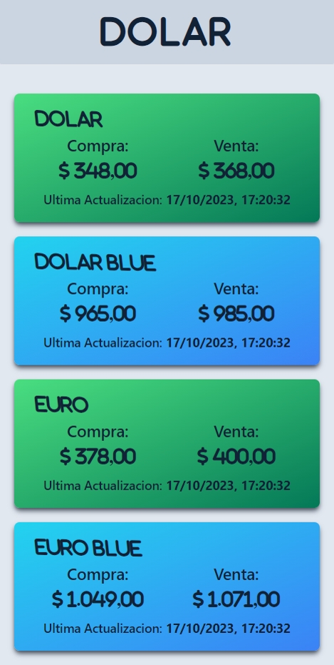

# Dollar App

Mini App para saber el Dolar Oficial y Blue de Argentina.

## Como ejecutar la aplicación:

#### 1 - Clonar el repositorio
    git clone https://github.com/FdR-23/Dollar-app.git
#### 2 - Instalar dependencias
    cd ../Dollar-app
    npm install
#### 3 - Inicializar App 
    npm run dev

## Author
 **Federico Rampi** 
*  <a href="https://portfolio-fdr.vercel.app/" target=”_blank”>Portfolio </a>
*  <a href="https://www.linkedin.com/in/federico-rampi/" target=”_blank”>LinkedIn </a>